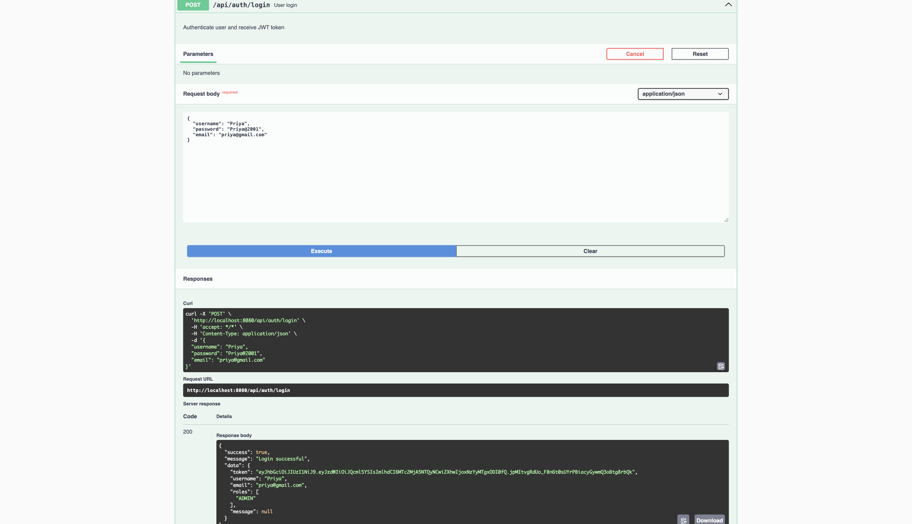
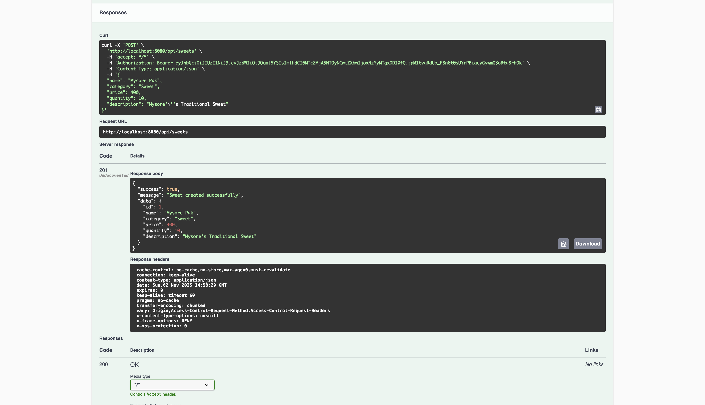

# TDD Kata: Sweet Shop Management System

A full-stack Sweet Shop Management System built using **Spring Boot (Java)** for the backend and **React (Material UI)** for the frontend.  
This project demonstrates API development, authentication with JWT, CRUD operations, and a responsive UI for managing sweets — all implemented with **Test-Driven Development (TDD)** principles and assisted by modern AI tools.

---

## Objective

The goal of this project is to design, build, and test a Sweet Shop Management System that supports both **user** and **admin** roles.  
Users can register, log in, and purchase sweets.  
Admins can add, update, restock, and delete sweets.

---

## Tech Stack

### Backend
- **Framework:** Spring Boot (Java)
- **Database:** MySQL
- **Security:** Spring Security with JWT
- **Documentation:** Swagger / OpenAPI 3.0
- **Testing:** JUnit + Mockito
- **Build Tool:** Maven

### Frontend
- **Framework:** React (Vite)
- **UI Library:** Material UI (MUI)
- **Routing:** React Router
- **HTTP Client:** Axios
- **Testing:** Jest + React Testing Library

---

## Project Structure

sweetshop/
│
├── backend/
│ ├── src/main/java/com/sweetshop
│ │ ├── controller/
│ │ ├── service/
│ │ ├── model/
│ │ ├── dto/
│ │ └── repository/
│ └── src/test/java/com/sweetshop
│
├── frontend/
│ ├── src/components/
│ ├── src/pages/
│ ├── src/services/
│ └── src/App.js
│
└── README.md

---

## Core Features

### Authentication
- `POST /api/auth/register` – Register a new user  
- `POST /api/auth/login` – Login and receive a JWT token  

### Sweet Management (Protected)
- `POST /api/sweets` – Add a new sweet  
- `GET /api/sweets` – Retrieve all sweets  
- `GET /api/sweets/search` – Search sweets by name, category, or price range  
- `PUT /api/sweets/{id}` – Update sweet details  
- `DELETE /api/sweets/{id}` – Delete sweet (**Admin only**)  

### Inventory Operations
- `POST /api/sweets/{id}/purchase` – Purchase a sweet (reduces quantity)  
- `POST /api/sweets/{id}/restock` – Restock a sweet (**Admin only**)  

---

My AI Usage

I actively used AI tools during the development of this project to assist with planning, debugging, and learning new techniques.

Tools I Used

ChatGPT (OpenAI) – for debugging backend issues, refining documentation, and clarifying JWT and Spring Security concepts.
Claude (Anthropic) – for code review suggestions, improving prompt clarity, and generating sample classes for the backend.

How I Used Them
I used ChatGPT for help understanding error messages and generating boilerplate code for DTOs, controllers, and unit tests.
Claude helped me analyze longer files, check for clean code practices, and refine logic for better consistency.

Copilot assisted with small frontend utilities and repetitive form logic in React components.

Gemini was used early in the process to visualize different approaches for UI filtering and card layouts.

Reflection

AI made the development process faster and smoother, but all final code decisions, debugging, and architectural structure were done by me.
Using AI felt like working with an intelligent assistant that helped reduce mental load, especially for syntax-heavy sections.
It allowed me to focus more on logic, testing, and TDD discipline rather than boilerplate coding.
Overall, AI tools complemented my workflow rather than replacing my effort.

### OUTPT SCREEN SHOT

